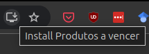
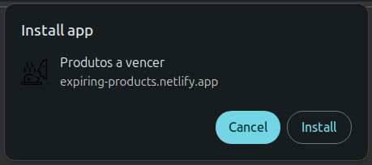
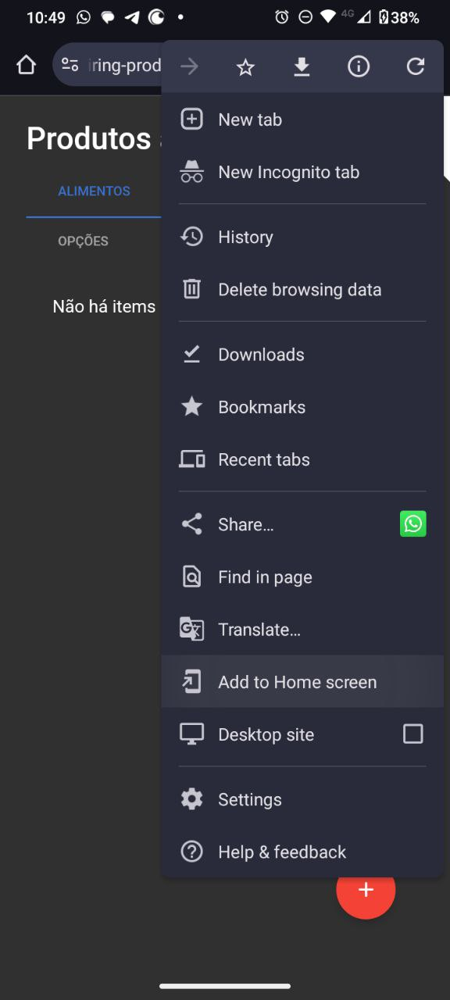
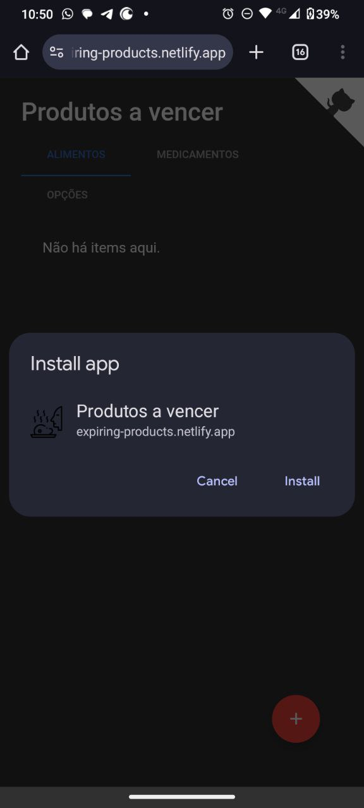
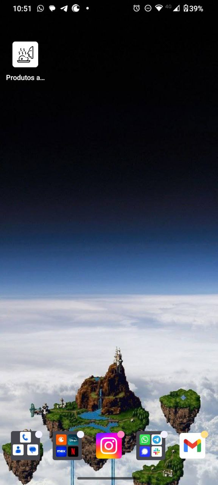

# Expiring Products

A simple web app to help controlling expiring products in my pantry. It uses [IndexedDB](https://developer.mozilla.org/en-US/docs/Web/API/IndexedDB_API) as a local database in the browser and [Web Storage](https://developer.mozilla.org/en-US/docs/Web/API/Web_Storage_API) to store history information for statistics purposes. It can also be installed locally as a [Progressive web app](https://developer.mozilla.org/en-US/docs/Web/Progressive_web_apps).

Since all information is stored locally, one can simply open the [web application](https://expiring-products.netlify.app/) and start using it. As long as the browser data for this site is not deleted, all the information will be there. If, for any reason, you want to delete your browser history, you can export your database as a JSON file and later import it again.

## Features

- Add products with name, expiration date, and quantity
- Mark products as opened, consumed, or discarded
- Products are sorted by closest to expiration date and then by larger quantity
- After a product is opened, its expiration date is updated based on the duration days from the opening date
- Export database as JSON file
- Import database from JSON file
- Install as a Progressive Web App
- Responsive design

## Installing on your local machine

1. Click on the install icon on the right side of the address bar

2. Confirm installation

3. Open the app from the installed icon

## Installing on your mobile device

1. Open the [web application](https://expiring-products.netlify.app/) on your mobile browser
2. Click on the three dots menu on the right side of the address bar
3. Click on "Add to Home screen"

4. Confirm installation

5. Open the app from the installed icon

6. Enjoy!

## TODO

- statistics tab
- improve UI
