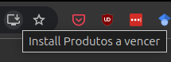
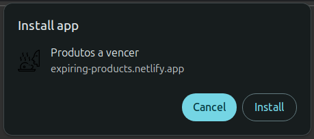
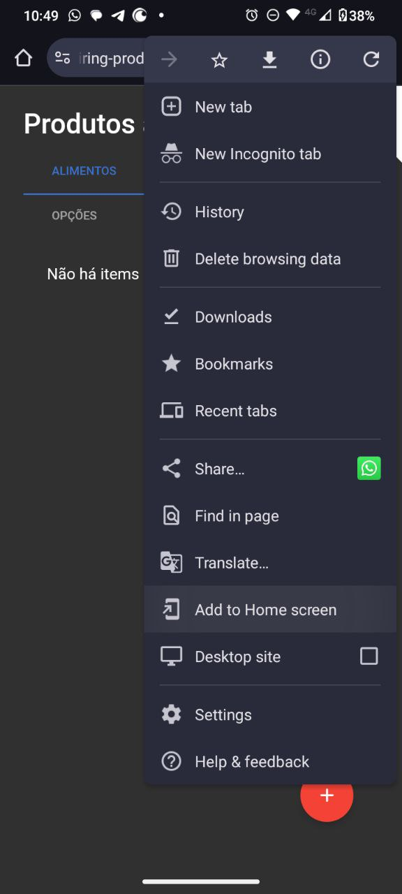
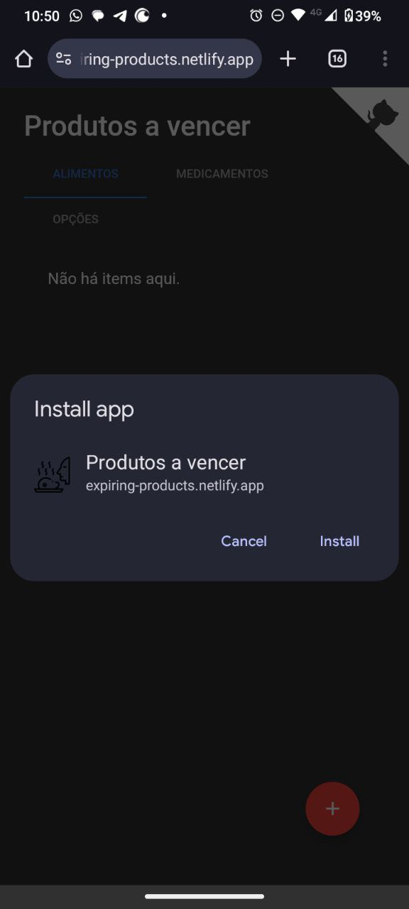
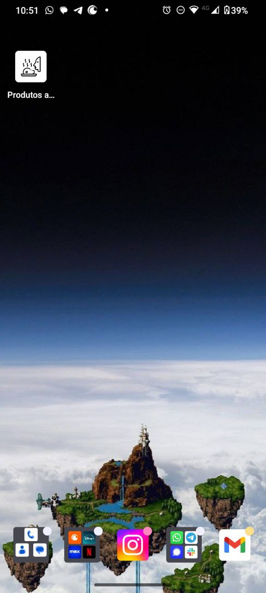

# Expiring Products

A simple web app to help controlling expiring products in my pantry. It uses [Firebase Firestore](https://firebase.google.com/docs/firestore) as a cloud database with real-time synchronization and [Firebase Authentication](https://firebase.google.com/docs/auth) for secure user accounts. It can also be installed locally as a [Progressive Web App](https://developer.mozilla.org/en-US/docs/Web/Progressive_web_apps).

To use the [web application](https://expiring-products.netlify.app/), create an account with your email and password. All your data is stored securely in the cloud and syncs automatically across all your devices. You can export your database as a JSON file for backup purposes or to transfer data between accounts.

## Features

- **User Authentication**: Secure login with email and password
- **Cloud Synchronization**: Data automatically syncs across all your devices
- **Custom Categories**: Create and manage your own product categories with custom emojis
- **Smart Product Management**: Add products with name, expiration date, quantity, and post-opening duration
- **Item Status Tracking**: Mark products as opened, consumed, or discarded
- **Intelligent Sorting**: Products sorted by expiration date, opened status, and quantity
- **Auto-Update Expiration**: Expiration dates automatically adjust when items are opened based on post-opening duration
- **Shopping Mode**: View recurring purchases and quickly add items to your pantry
- **Visual Warnings**: Color-coded alerts for items expiring soon or already expired
- **Search and Filter**: Find items quickly with search and filter by opened/unopened status
- **Flexible Sorting**: Sort by date, name, or quantity in ascending or descending order
- **Data Backup**: Export database as JSON file for backup or account transfer
- **Data Import**: Restore data from JSON backup files
- **Progressive Web App**: Install on desktop or mobile for offline access
- **Responsive Design**: Works seamlessly on phones, tablets, and computers
- **Statistics Tracking**: Track consumption and waste patterns (for future analytics features)

## Getting Started

### Creating an Account

1. Visit [expiring-products.netlify.app](https://expiring-products.netlify.app/)
1. Enter your email address and a secure password
1. Click **Sign Up** to create your account
1. Start adding products to your pantry!

### Logging In

1. Enter your email and password
1. Click **Login**
1. Your data will automatically sync from the cloud

### Forgot Password?

Click the **Forgot Password?** link on the login screen and follow the instructions sent to your email.

## Installing on your local machine

1. Click on the install icon on the right side of the address bar

2. Confirm installation

3. Open the app from the installed icon

## Installing on your mobile device

1. Open the [web application](https://expiring-products.netlify.app/) on your mobile browser
2. Click on the three dots menu on the right side of the address bar
3. Click on "Add to Home screen"

4. Confirm installation

5. Open the app from the installed icon

6. Enjoy!

## Push Notifications

The app can send you notifications when products are about to expire (within 5 days). This feature helps you stay on top of your pantry items and avoid wasting food.

### Enabling Notifications

1. Open the app and navigate to the **Options** tab
2. Find the **Push Notifications** section
3. Toggle the **Enable notifications** switch
4. Allow notification permission when prompted by your browser

### How It Works

- Notifications are checked **daily at midnight**
- You'll receive a notification if you have products expiring in 5 days or less
- The notification shows:
  - Number of products expiring
  - List of product names (up to 5 items)
  - Days until expiration
- Clicking the notification opens the app

### Browser Support

Push notifications work on most modern browsers:

- ✅ Chrome (Desktop & Android)
- ✅ Firefox (Desktop & Android)
- ✅ Edge (Desktop)
- ✅ Safari (macOS 16.4+, iOS 16.4+)
- ✅ Opera (Desktop & Android)

**Note:** Notification behavior may vary depending on your device's settings and browser configuration.

### Privacy

All notifications are generated **locally on your device**. No data is sent to external servers. The notification system uses the browser's built-in Notification API and Service Worker.

## TODO

- Statistics tab with consumption and waste analytics
- Improve UI with additional visual enhancements
- Sharing categories between users
